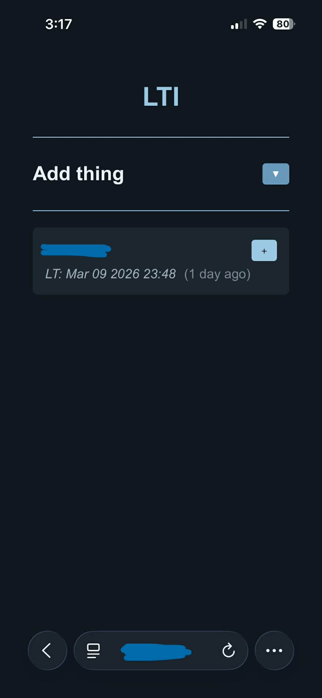
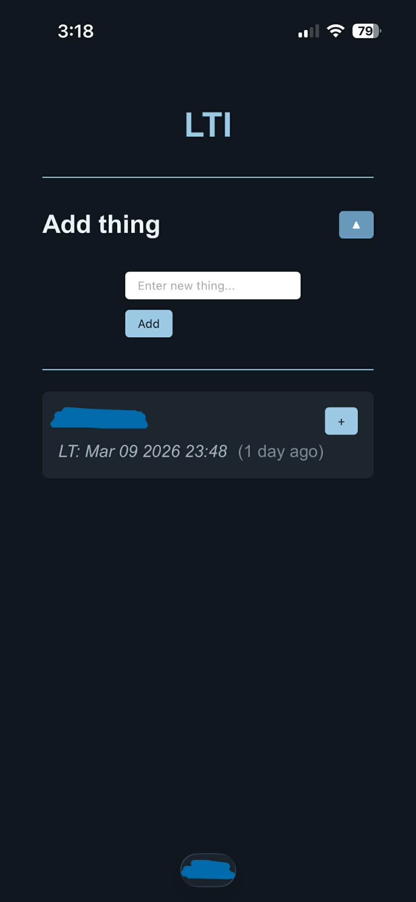

# LTI (Last Time I)

**LTI** is a lightweight dashboard to track the last time you did something. It’s perfect for keeping track of routine tasks or habits, whether you want to do them more often, less often or just need to remember the date. For example:

- Changed your car’s oil
- Washed your hair
- Took medication
- ...etc...

It can be adapted depending on your personal needs.

#### Why
I designed this tool to simplify task tracking and organisation, especially for managing a busy workflow. It started as a personal solution to help me remember when I last did certain things, and it has grown into a robust tool. **LTI keeps a simple, visual log without requiring a database or complicated setup.**

---

## Features

- Add new things to track
- Update the “last time I” timestamp
- Shows *(X days ago)* for each item
- Prevents duplicate entries
- **Lightweight**, no database required (stores history in plain text files)
- Minimal, practical UI

---

## Tech Stack

- **Frontend:** JavaScript, HTML
- **Backend:** PHP (saves and loads text files)
- **Storage:** Local text files in */cards* folder
- **Runs On:** A server or a Raspberry Pi (I run it on a Raspberry Pi 4b with Lighttpd, protected with a password using the htpasswd tool)

---

## Usage

- Click **▼** to open the add panel.
- Enter the name of the task or habit you want to track, then click **Add**.
- Your new card appears with the current date/time.
- Click the **+** on any card to update its timestamp to the current date/time.
- The `(X days ago)` label makes it quicker to see when the last time you did something was, no need to check the date.

---

## File Structure

/cards/           # Text files storing dates history 
index.html        # Main HTML page  
styles.css        # CSS styling  
main.js           # JS logic  
save.php          # Saves date updates to files  
load.php          # Loads saved cards  

---

## Future Improvements

- Auto-refresh of `(X days ago)`
- Implement use of different users for others in the home
- Automatic reduction of saved dates in the files to keep it lightweight

---

## Mobile demo

---

## Desktop demo

